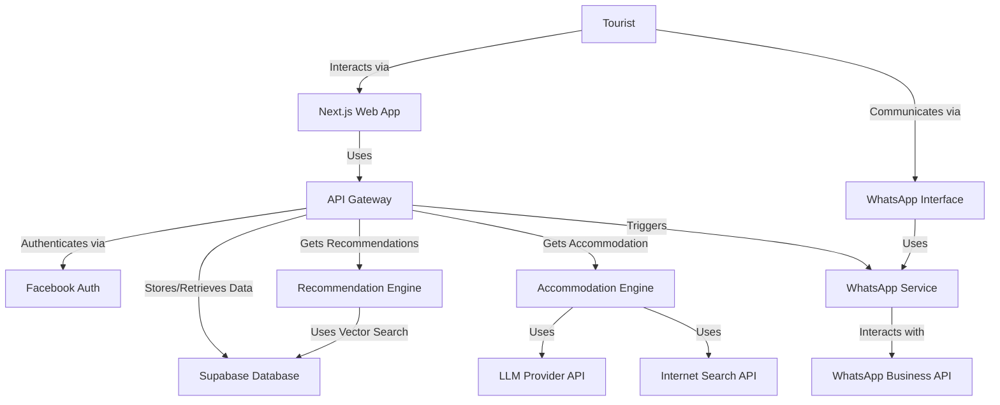
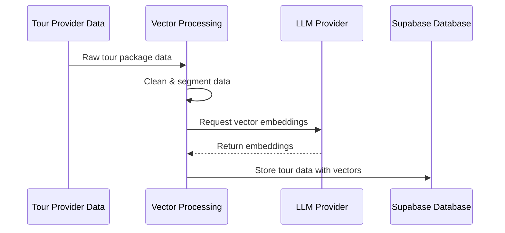
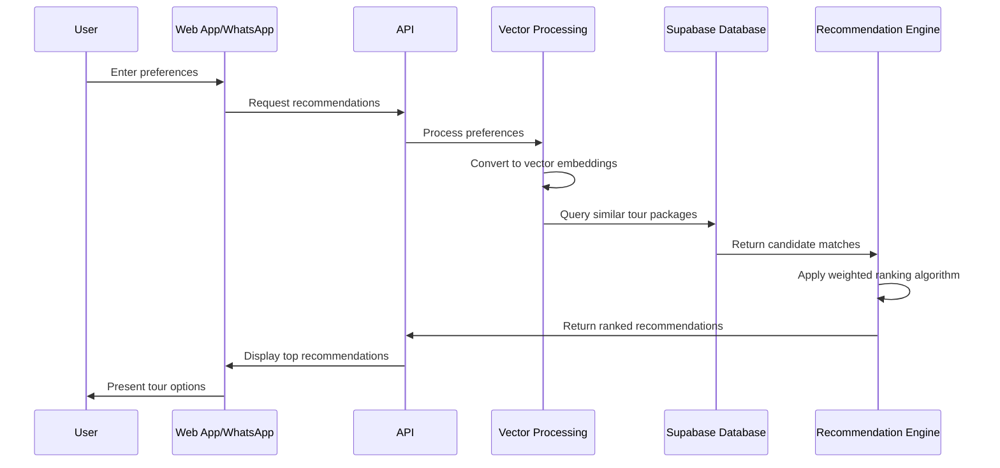
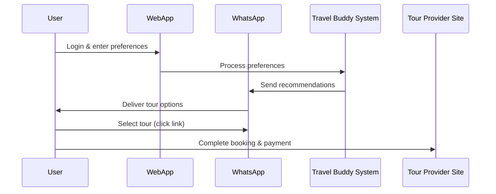

# Travel Buddy System - Presentation Summary

## 1. Executive Summary
- AI-powered travel recommendation platform using WhatsApp
- Simplifies tour discovery, booking, and accommodation finding
- Personalized recommendations based on user preferences
- Seamless booking process with WhatsApp integration

## 2. Core Problem & Solution
### Problems:
- Difficulty finding personalized tour packages
- Inconvenient booking processes
- Limited accommodation recommendations

### Solution:
- AI-driven personalized tour recommendations
- WhatsApp as primary interaction channel
- Simplified booking with clear payment pathways
- Accommodation recommendations near destinations

## 3. System Architecture

## 4. Key Components
### User Interfaces:
- NextJS web application for registration and preferences
- WhatsApp interface for recommendations and interaction

### Backend Services:
- API Gateway for orchestration and business logic
- Recommendation Engine using LlamaIndex/RAG
- Accommodation Engine using LLM and search
- WhatsApp Integration Service
- Vector Data Processing Pipeline

### Data Store:
- Supabase Database (PostgreSQL with pgvector extension)

## 5. Recommendation Algorithm
- Multi-dimensional vector matching with weighted criteria:
  - Locations (45.5%)
  - Duration (18.2%)
  - Budget (9.1%)
  - Transportation (9.1%)
  - Food (4.5%)
  - Activities (4.5%)
  - Accommodation & Notes (9.0%)

## 6. Data Flows

### Tour Data Ingestion Flow

### User Search & Recommendation Flow

### Tour Discovery & Booking Flow

## 7. Technology Stack

### Frontend:
- NextJS, React, Tailwind CSS

### Backend:
- FastAPI (Python), JWT, OAuth 2.0

### AI/ML Technologies:
- LlamaIndex with RAG architecture
- OpenAI text-embedding-3-small (1536-dimensional embeddings)
- pgvector for vector search operations

### Data Storage:
- PostgreSQL via Supabase with vector capabilities

## 8. Implementation Plan

### Key Objectives:
1. Personalized recommendations via NextJS app
2. AI-powered tour recommendation generation
3. WhatsApp integration for communication
4. Seamless tour booking process
5. Accommodation recommendations upon request

### In-Progress Tasks:
- Supabase database schema & vector extension setup
- NextJS frontend development
- Python API gateway implementation
- Facebook authentication flow
- Vector-based recommendation engine development

## 9. Technical Innovations
- Multi-dimensional vector matching for preferences
- WhatsApp as primary interaction channel
- Weighted scoring algorithm for relevance
- Vector database for semantic search
- Separate accommodation engine for additional options

## 10. Business Value
- Enhanced user experience through personalization
- Increased engagement via familiar WhatsApp platform
- Higher conversion rates with simplified booking
- Scalable architecture for future growth
- Data-driven insights from user preferences
