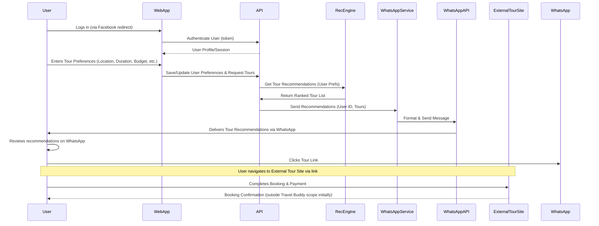
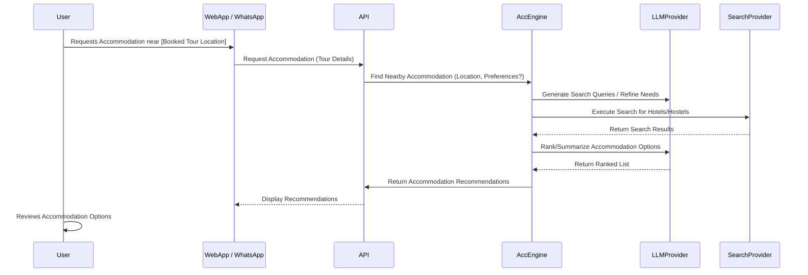

# Problem Statements
1. Tourists (both foreigners and Vietnamese) face challenges in discovering tours of interest and engaging with tour guides or companies.
2. Booking tours and finding nearby accommoedation are often complicated and unclear.
3. Capturing customer preferences through direct interactions is difficult.
4. Leveraging travel history to provide personalized recommendations is under utilized

# Solution:
Travel Buddy application, integrating AI-driven functionalities to address the defined objectives and problem statements. The solution prioritizes WhatsApp as the main platform  as supplementary options for broader engagement.


# User Stories

*   As a Tourist, I want to tell the Travel Buddy app the location(s) I'm interested in visiting and the duration(s) I have available, so that it can find relevant tour options for me.
*   As a Tourist, I want to receive tailored tour recommendations directly in WhatsApp based on the locations, durations, and my preferences (like hobbies/past travel), so that I get convenient and personalized suggestions.
*   As a Tourist, I want to use WhatsApp to interact with the travel buddy service so that I can easily ask questions and manage my travel plans on a familiar platform.
*   As a Tourist, I want a simple and clear process to book a tour once I've decided on one so that I don't get frustrated or confused during the booking.
*   As a Tourist, I want to get recommendations for nearby accommodation (hotels, hostels) for a booked tour so that I can conveniently plan where to stay.

# User action flow
- User logon to Travel Buddy using their Facebook account. User profile will be captured into users table.
- User select the list of tour locations user want to take and fill in the following information per tour location:
    - User selects budget constraints  i.e < $1000 for Hanoi tour, < 1200 for Da Nang tour, < 1500 for Ho Chi Minh tour
    - User selects food favorites for each tour location for example: Japanese , Vietnamese street foods, Chinese fine dining restaurants.
    - User selects preferred travel transportation such 4 seats car, intercity bus, or train or user self-arranges
    - User selects preferred accommocations: hotels, hostels, backpackers, motels or user self-arranges,
    - User selects activties they would like to participate such as shopping and musiuem and historical places in Ho Chi Minh tour location or for Da Nang tour visit Ba Na Hill, selfie at Golden Bridge try fresh seefoods, visit Old Quarter Hoi An. For Hanoi visit 36 streets Old Quarter, view Ngoc Son Temple and Hoan Kiem lake, Water Puppet Show, Ho Chi Minh's Mausoleum
    - User select extra notes: prefer to stay in center city for convenience in Ho Chi Minh tour, stay close to the beach in Da Nang, stay close to nature in Hanoi, traffic noice avoidance. etc.
- User clicks Save to query the search the tour packages
- Travel Buddy will send a list of recommended tour packages to user WhatsApp messenger . Each item contains tour payment link and tour contact number/email
- User clicks on a specific tour to take them to tour package site to complete the tour payment.

# Technical stack and implementation

Using LLamaIndex framework and RAG to incoporate input data such user profiles such as hobbies, location of interests, agency tour packages to full text search and sematic search to search and sort recommended tours from highest to lowest ranks
The system output the top 10 of tour packages with sufficient informations through restful apis as following:
 - tour package title, description summary
 - the link to complete the tour registration and payment
 - agency contacts for further infos

- Frontend uses NextJS framework
- Data Storage uses superbase

Leverage LLM model with internet search to find nearby accomodation/hotels/hostels that is convenient to take the tours

## High-Level Architecture

```mermaid
graph TD
    subgraph "User Interfaces"
        UI_App[Next.js Web App]
        UI_WhatsApp[WhatsApp Interface]
    end

    subgraph "Backend Services"
        API[API Gateway / Backend (Python)]
        RecEngine[Recommendation Engine (LlamaIndex/RAG)]
        AccEngine[Accommodation Engine (LLM + Search)]
        WhatsAppService[WhatsApp Integration Service]
    end

    subgraph "Data Stores"
        DB[Supabase Database (Postgres + Vector)]
    end

    subgraph "External Systems"
        Auth[Facebook Auth]
        Payment[Tour Payment Gateway (External)]
        WhatsAppAPI[WhatsApp Business API]
        LLMProvider[LLM Provider API]
        SearchProvider[Internet Search API]
        TourProviderData[Tour Provider Data Sources]
    end

    User[Tourist] -- Interacts via --> UI_App
    User -- Interacts via --> UI_WhatsApp

    UI_App -- Uses --> API
    UI_WhatsApp -- Uses --> WhatsAppService

    API -- Authenticates via --> Auth
    API -- Stores/Retrieves User Data --> DB
    API -- Gets Recommendations --> RecEngine
    API -- Gets Accommodation Info --> AccEngine
    API -- Triggers --> WhatsAppService

    WhatsAppService -- Interacts with --> WhatsAppAPI
    WhatsAppService -- Uses --> API

    RecEngine -- Uses --> DB[Vector Search on travel_packages]
    RecEngine -- Uses --> TourProviderData[Ingested Tour Data]

    AccEngine -- Calls --> LLMProvider
    AccEngine -- Calls --> SearchProvider

    API -- Redirects to --> Payment
```

## User Flow Diagrams

**Tour Discovery & Recommendation Flow:**


**Accommodation Recommendation Flow:**


# Objectives and Milestones

| Objective                       | Milestone                                                               | Target Completion Date | Status      | Note                                                                       |
| :------------------------------ | :---------------------------------------------------------------------- | :--------------------- | :---------- | :------------------------------------------------------------------------- |
| Personalized Recommendations    | User can input locations & durations                                    | TBD                    | Not Started | Allow multiple locations/durations. Input via app/WhatsApp interface.       |
| Personalized Recommendations    | AI processes input & generates tour recommendations                     | TBD                    | Not Started | Considers locations, durations, user profile (hobbies, history). Use LlamaIndex. |
| Personalized Recommendations    | Send recommendations via WhatsApp                                       | TBD                    | Not Started | Requires WhatsApp API integration.                                         |
| Seamless Tour Booking           | Simple tour booking process                                             | TBD                    | Not Started | Clear flow within app/WhatsApp.                                            |
| Convenient Accommodation        | Recommend nearby accommodation for booked tours                         | TBD                    | Not Started | Leverage LLM with internet search. Triggered after tour booking.           |
| Core WhatsApp Interaction       | Basic WhatsApp interaction for queries/management                       | TBD                    | Not Started | Foundation for other WhatsApp features.                                    |

# AI Model Specific Tasks Progress

| Task                                                   | Current Status | Notes / Adjustments Needed                                  |
| :----------------------------------------------------- | :------------- | :---------------------------------------------------------- |
| Setup LlamaIndex Framework Integration                 | Not Started    | Choose appropriate index structure, configure environment.      |
| Develop Data Ingestion for LlamaIndex (User Profiles)  | Not Started    | Define data format, privacy considerations.                 |
| Develop Data Ingestion for LlamaIndex (Tour Packages) | Not Started    | Define data format, update frequency.                       |
| Develop Recommendation Logic using LlamaIndex          | Not Started    | Querying strategy based on user input & profile.            |
| Setup LLM & Internet Search Integration (Accommodation) | Not Started    | Select LLM provider/model, configure search access.          |
| Develop Accommodation Search & Ranking Logic           | Not Started    | Prompt engineering, result filtering based on tour location. |
| Evaluate Recommendation Model Performance              | Not Started    | Define metrics (e.g., relevance, diversity).                |
| Evaluate Accommodation Search Performance              | Not Started    | Define metrics (e.g., accuracy, proximity).                 |

# Business Model Specific Tasks Progress

| Task                                          | Current Status | Notes / Adjustments Needed                                       |
| :-------------------------------------------- | :------------- | :--------------------------------------------------------------- |
| Define Target Audience & Market Analysis      | Not Started    | Research tourist demographics, competitor analysis.              |
| Develop Partnerships (Tour Agencies/Guides) | Not Started    | Identify potential partners, define collaboration terms.         |
| Finalize Monetization Strategy                | Not Started    | e.g., Commission model, subscription, advertising?             |
| Develop Marketing & User Acquisition Plan   | Not Started    | Channels (social media, ads, travel blogs), launch strategy.   |
| Define Customer Support Process               | Not Started    | How will user inquiries/issues be handled? (e.g., via WhatsApp) |
| Address Legal & Compliance Requirements     | Not Started    | Data privacy (GDPR/local laws), Terms of Service, payment rules. |

## Database Schema (ER Diagram)

```mermaid
erDiagram
    users ||--o{ user_interests : "has"
    locations ||--o{ user_interests : "has interest for"
    locations ||--o{ travel_packages : "has packages for"
    providers ||--o{ travel_packages : "offers"

    users {
        uuid id PK
        text name
        text email UK
        text profile_picture
        text bio
    }

    locations {
        uuid id PK
        text name
        text country
        text[] tags
        text description
        text image_url
    }

    providers {
        uuid id PK
        text name
        text logo_url
        text description
        text website
    }

    travel_packages {
        uuid id PK
        uuid provider_id FK
        uuid location_id FK
        text title
        numeric price
        int duration_days
        text[] highlights
        text description
        text image_url
        vector location_vector
        vector duration_vector
        vector budget_vector
        vector transportation_vector
        vector food_vector
        vector activities_vector
        vector notes_vector
    }

    user_interests {
        uuid id PK
        uuid user_id FK
        uuid location_id FK
        int priority_level
        bigint budget
        text activities
        text notes
    }
