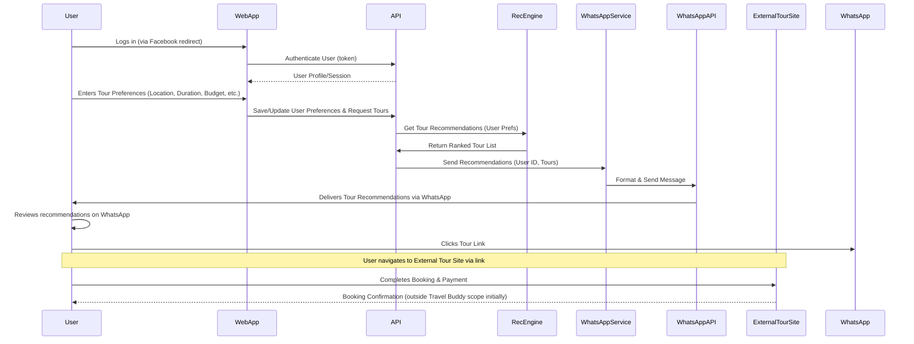
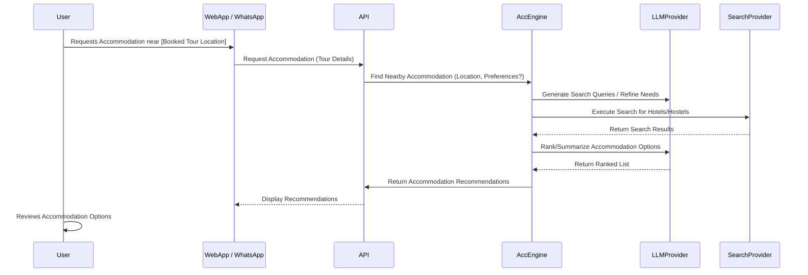

# Problem Statements
1. Tourists (both international and domestic) face challenges discovering relevant tours and effectively engaging with tour guides or companies.
2. The process of booking tours and finding nearby accommodation is often complicated and lacks clarity.
3. Capturing detailed customer preferences through direct interaction can be difficult.
4. Leveraging users' travel history to provide personalized recommendations is currently underutilized.

# Solution
We propose the Travel Buddy application, which integrates AI-driven functionalities to address the identified problems and objectives. The solution prioritizes WhatsApp as the primary user interaction platform, complemented by a web application for broader engagement and detailed preference input.


# User Stories

*   As a Tourist, I want to tell the Travel Buddy app the location(s) I'm interested in visiting and the duration(s) I have available, so that it can find relevant tour options for me.
*   As a Tourist, I want to receive tailored tour recommendations directly in WhatsApp based on the locations, durations, and my preferences (like hobbies/past travel), so that I get convenient and personalized suggestions.
*   As a Tourist, I want to use WhatsApp to interact with the travel buddy service so that I can easily ask questions and manage my travel plans on a familiar platform.
*   As a Tourist, I want a simple and clear process to book a tour once I've decided on one so that I don't get frustrated or confused during the booking.
*   As a Tourist, I want to get recommendations for nearby accommodation (hotels, hostels) for a booked tour so that I can conveniently plan where to stay.

# User Action Flow
- The user logs into Travel Buddy using their Facebook account. Their profile information is captured and stored in the `users` table.
- The user selects desired tour locations and provides the following details for each:
    - **Budget Constraints:** Specifies maximum budget per location (e.g., < $1000 for Hanoi, < $1200 for Da Nang, < $1500 for Ho Chi Minh City).
    - **Food Preferences:** Selects preferred cuisine types or dining styles (e.g., Japanese, Vietnamese street food, Chinese fine dining).
    - **Transportation:** Chooses preferred travel methods (e.g., 4-seat car, intercity bus, train) or indicates self-arranged transport.
    - **Accommodation:** Selects preferred lodging types (e.g., hotels, hostels, backpacker inns, motels) or indicates self-arranged accommodation.
    - **Activities:** Lists desired activities for each location (e.g., Shopping, museums, historical sites in Ho Chi Minh City; Ba Na Hills visit, Golden Bridge selfie, fresh seafood, Hoi An Old Quarter visit in Da Nang; 36 Streets Old Quarter tour, Ngoc Son Temple, Hoan Kiem Lake visit, Water Puppet Show, Ho Chi Minh's Mausoleum visit in Hanoi).
    - **Additional Notes:** Provides specific requests or preferences (e.g., "prefer central city location for convenience in Ho Chi Minh City," "stay close to the beach in Da Nang," "stay close to nature in Hanoi," "avoid traffic noise").
- The user clicks "Save" to initiate the search for matching tour packages.
- Travel Buddy sends a list of recommended tour packages to the user's WhatsApp messenger. Each recommendation includes:
    - A link for tour registration and payment.
    - Contact information (phone/email) for the tour agency.
- The user clicks a specific tour link, which redirects them to the tour package provider's site to complete the booking and payment process.

# Technical Stack and Implementation Overview
- **Recommendation Core:** Utilize the LlamaIndex framework with Retrieval-Augmented Generation (RAG) to process input data (user profiles, preferences, tour package details). Perform full-text and semantic searches to find and rank relevant tour recommendations.
- **API Output:** The system will provide the top 10 recommended tour packages via RESTful APIs, containing:
    - Tour package title and summary description.
    - Link to complete tour registration and payment.
    - Agency contact information for further inquiries.
- **Frontend:** Developed using the Next.js framework.
- **Data Storage:** Implemented using Supabase (PostgreSQL with vector support).
- **Accommodation Search (Secondary):** Leverage an LLM combined with internet search capabilities to find nearby accommodation options (hotels, hostels) when requested or needed.

## High-Level Architecture

```mermaid
graph TD
    subgraph "User Interfaces"
        UI_App[Next.js Web App]
        UI_WhatsApp[WhatsApp Interface]
    end

    subgraph "Backend Services"
        API[API Gateway / Backend (Python)]
        RecEngine[Recommendation Engine (LlamaIndex/RAG)]
        AccEngine[Accommodation Engine (LLM + Search)]
        WhatsAppService[WhatsApp Integration Service]
    end

    subgraph "Data Stores"
        DB[Supabase Database (Postgres + Vector)]
    end

    subgraph "External Systems"
        Auth[Facebook Auth]
        Payment[Tour Payment Gateway (External)]
        WhatsAppAPI[WhatsApp Business API]
        LLMProvider[LLM Provider API]
        SearchProvider[Internet Search API]
        TourProviderData[Tour Provider Data Sources]
    end

    User[Tourist] -- Interacts via --> UI_App
    User -- Interacts via --> UI_WhatsApp

    UI_App -- Uses --> API
    UI_WhatsApp -- Uses --> WhatsAppService

    API -- Authenticates via --> Auth
    API -- Stores/Retrieves User Data --> DB
    API -- Gets Recommendations --> RecEngine
    API -- Gets Accommodation Info --> AccEngine
    API -- Triggers --> WhatsAppService

    WhatsAppService -- Interacts with --> WhatsAppAPI
    WhatsAppService -- Uses --> API

    RecEngine -- Uses --> DB[Vector Search on travel_packages]
    RecEngine -- Uses --> TourProviderData[Ingested Tour Data]

    AccEngine -- Calls --> LLMProvider
    AccEngine -- Calls --> SearchProvider

    API -- Redirects to --> Payment
```

## User Flow Diagrams

**Tour Discovery & Recommendation Flow:**


**Accommodation Recommendation Flow:**


# Objectives and Milestones

| Objective                       | Milestone                                                               | Target Completion Date | Status      | Note                                                                       |
| :------------------------------ | :---------------------------------------------------------------------- | :--------------------- | :---------- | :------------------------------------------------------------------------- |
| Personalized Recommendations    | User can input locations & durations                                    | TBD                    | Not Started | Allow multiple locations/durations. Input via app/WhatsApp interface.       |
| Personalized Recommendations    | AI processes input & generates tour recommendations                     | TBD                    | Not Started | Considers locations, durations, user profile (hobbies, history). Use LlamaIndex. |
| Personalized Recommendations    | Send recommendations via WhatsApp                                       | TBD                    | Not Started | Requires WhatsApp API integration.                                         |
| Seamless Tour Booking           | Simple tour booking process                                             | TBD                    | Not Started | Clear flow within app/WhatsApp.                                            |
| Convenient Accommodation        | Recommend nearby accommodation for booked tours                         | TBD                    | Not Started | Leverage LLM with internet search. Triggered after tour booking.           |
| Core WhatsApp Interaction       | Basic WhatsApp interaction for queries/management                       | TBD                    | Not Started | Foundation for other WhatsApp features.                                    |

# AI Model Specific Tasks Progress

| Task                                                   | Current Status | Notes / Adjustments Needed                                  |
| :----------------------------------------------------- | :------------- | :---------------------------------------------------------- |
| Setup LlamaIndex Framework Integration                 | Not Started    | Choose appropriate index structure, configure environment.      |
| Develop Data Ingestion for LlamaIndex (User Profiles)  | Not Started    | Define data format, privacy considerations.                 |
| Develop Data Ingestion for LlamaIndex (Tour Packages) | Not Started    | Define data format, update frequency.                       |
| Develop Recommendation Logic using LlamaIndex          | Not Started    | Querying strategy based on user input & profile.            |
| Setup LLM & Internet Search Integration (Accommodation) | Not Started    | Select LLM provider/model, configure search access.          |
| Develop Accommodation Search & Ranking Logic           | Not Started    | Prompt engineering, result filtering based on tour location. |
| Evaluate Recommendation Model Performance              | Not Started    | Define metrics (e.g., relevance, diversity).                |
| Evaluate Accommodation Search Performance              | Not Started    | Define metrics (e.g., accuracy, proximity).                 |

# Business Model Specific Tasks Progress

| Task                                          | Current Status | Notes / Adjustments Needed                                       |
| :-------------------------------------------- | :------------- | :--------------------------------------------------------------- |
| Define Target Audience & Market Analysis      | Not Started    | Research tourist demographics, competitor analysis.              |
| Develop Partnerships (Tour Agencies/Guides) | Not Started    | Identify potential partners, define collaboration terms.         |
| Finalize Monetization Strategy                | Not Started    | e.g., Commission model, subscription, advertising?             |
| Develop Marketing & User Acquisition Plan   | Not Started    | Channels (social media, ads, travel blogs), launch strategy.   |
| Define Customer Support Process               | Not Started    | How will user inquiries/issues be handled? (e.g., via WhatsApp) |
| Address Legal & Compliance Requirements     | Not Started    | Data privacy (GDPR/local laws), Terms of Service, payment rules. |

## Database Schema (ER Diagram)

```mermaid
erDiagram
    users ||--o{ user_interests : "has"
    locations ||--o{ user_interests : "has interest for"
    locations ||--o{ travel_packages : "has packages for"
    providers ||--o{ travel_packages : "offers"

    users {
        uuid id PK
        text name
        text email UK
        text profile_picture
        text bio
    }

    locations {
        uuid id PK
        text name
        text country
        text[] tags
        text description
        text image_url
    }

    providers {
        uuid id PK
        text name
        text logo_url
        text description
        text website
    }

    travel_packages {
        uuid id PK
        uuid provider_id FK
        uuid location_id FK
        text title
        numeric price
        int duration_days
        text[] highlights
        text description
        text image_url
        vector location_vector
        vector duration_vector
        vector budget_vector
        vector transportation_vector
        vector food_vector
        vector activities_vector
        vector notes_vector
    }

    user_interests {
        uuid id PK
        uuid user_id FK
        uuid location_id FK
        int priority_level
        bigint budget
        text activities
        text notes
    }
