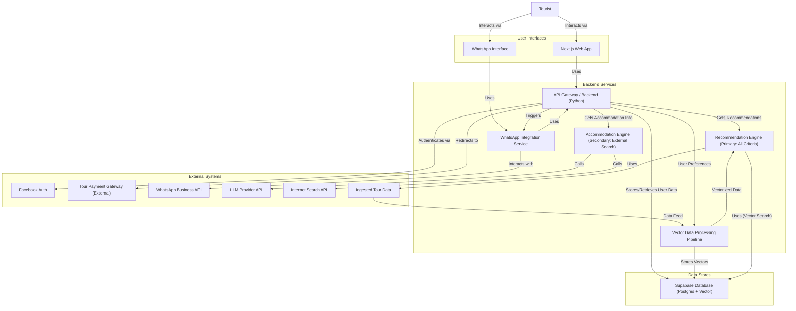
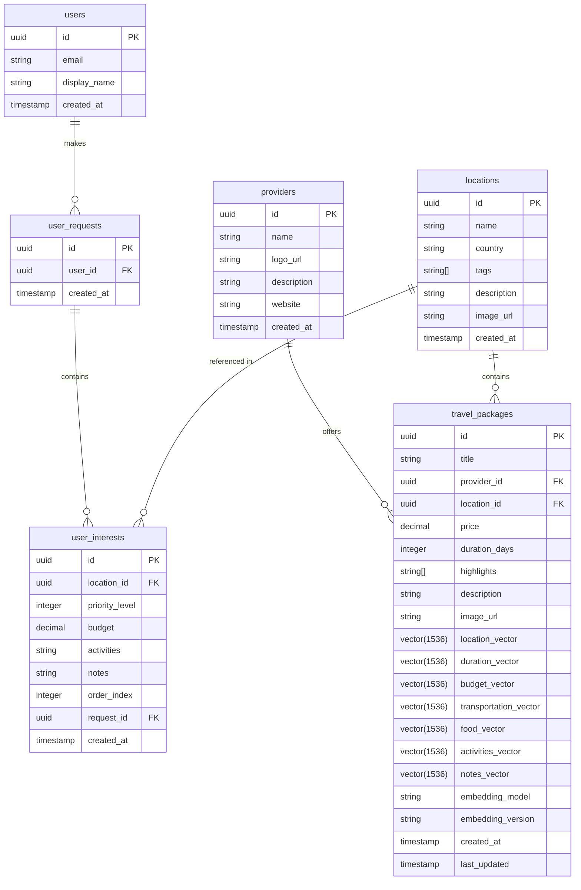
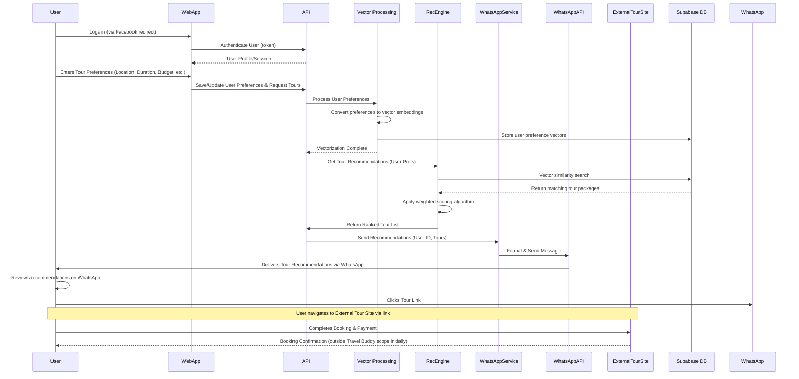
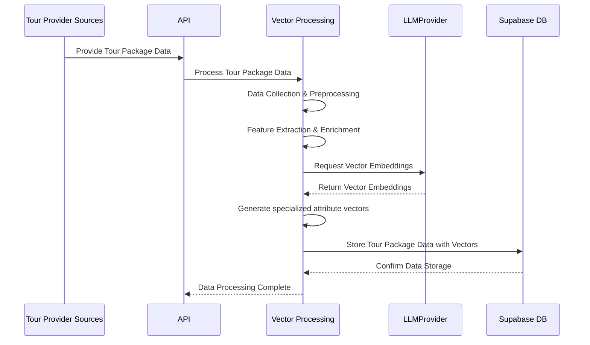

# Technical Architecture Solution for Travel Buddy System

<solution>
# Travel Buddy System - Technical Architecture Documentation

## 1. Executive Summary

The Travel Buddy system is an AI-powered travel recommendation platform designed to simplify tour discovery, booking, and accommodation finding for both foreign and Vietnamese tourists. The architecture leverages modern technologies including LlamaIndex for AI-powered recommendations, NextJS for the frontend, and Supabase for data storage, with WhatsApp as the primary interaction channel.

This solution addresses key pain points in the travel industry through:
- Personalized tour recommendations based on user preferences and locations of interest
- Seamless WhatsApp integration for convenient access and notifications
- Simplified tour booking process with clear payment pathways
- AI-driven nearby accommodation recommendations
- Vector search capabilities for semantic matching of user preferences with tour packages

The architecture prioritizes scalability, security, and user experience while providing a modular foundation that can evolve with changing business requirements.

## 2. System Overview

The Travel Buddy architecture follows a microservices approach with clearly defined components handling specific responsibilities. The system is designed to be cloud-native, scalable, and secure.

### 2.1 High-Level Architecture

The system consists of four major component groups:

1. **User Interfaces**:
   - NextJS web application for user registration and preference input
   - WhatsApp interface for receiving recommendations and interacting with the system

2. **Backend Services**:
   - API Gateway/Backend for orchestration and business logic
   - Recommendation Engine powered by LlamaIndex/RAG (Handles matching for all user criteria, including location, duration, budget, food, activities, and included accommodation/transportation preferences)
   - Accommodation Engine leveraging LLM with internet search (Secondary engine for finding alternative/external accommodation or details when not covered adequately in tour packages)
   - WhatsApp Integration Service for messaging
   - Vector Data Processing Pipeline for transforming raw tour data and user preferences into vector embeddings for semantic matching

3. **Data Stores**:
   - Supabase Database (PostgreSQL with vector capabilities)

4. **External Systems**:
   - Facebook Authentication
   - Tour Payment Gateway
   - WhatsApp Business API
   - LLM Provider API
   - Internet Search API
   - Tour Provider Data Sources

The system boundaries are clearly defined, with internal components handling core functionality (user profiles, preferences, recommendations) while external systems manage authentication, messaging, and payment processing.



## 3. Architecture Components

### 3.1 User Interfaces

#### 3.1.1 NextJS Web Application
- **Functionality**: Provides responsive web interface for users to register, login, and set preferences
- **Key Features**:
  - Facebook authentication integration
  - Multi-step preference capture interface (locations, budget, food, transportation, activities)
  - Responsive design for mobile and desktop users
  - Progressive web app capabilities for improved mobile experience

#### 3.1.2 WhatsApp Interface
- **Functionality**: Enables users to receive recommendations and interact with the system
- **Key Features**:
  - Rich message formatting for tour recommendations
  - Interactive buttons for quick responses
  - Media sharing for tour images
  - Natural language understanding for user queries

### 3.2 Backend Services

#### 3.2.1 API Gateway / Backend (Python)
- **Functionality**: Central orchestration point for all services
- **Key Responsibilities**:
  - Authentication and authorization management
  - User profile and preferences handling
  - Service coordination
  - Request validation and error handling
  - Rate limiting and traffic management

#### 3.2.2 Recommendation Engine (LlamaIndex/RAG)
- **Functionality**: Core intelligent component for generating personalized recommendations
- **Key Features**:
  - Vector embedding and indexing of tour packages
  - Semantic search capabilities using LlamaIndex
  - Retrieval-Augmented Generation for enhanced recommendations
  - Multi-dimensional preference matching (location, budget, activities, etc.)
  - Ranking algorithm for recommendation relevance

#### 3.2.2.1 Recommendation Ranking Algorithm

The engine employs a weighted scoring algorithm based on semantic vector similarity to rank tour packages against user preferences across multiple criteria.

**Ranking Criteria & Normalized Weights:**

User preferences are matched against tour package attributes using the following normalized weights (adjusted to sum to 100%):

*   **Locations:** 45.5% (Matches `user_interest` location against `package.location_vector`)
*   **Duration:** 18.2% (Matches `user_interest` duration against `package.duration_vector`)
*   **Budget:** 9.1% (Matches `user_interest` budget against `package.budget_vector` or derived from `package.price`)
*   **Transportation:** 9.1% (Matches `user_interest` transport preference against `package.transportation_vector`)
*   **Food:** 4.5% (Matches `user_interest` food preference against `package.food_vector`)
*   **Activities:** 4.5% (Matches `user_interest` activity preference against `package.activities_vector`)
*   **Accommodation & Notes:** 9.0% (Matches combined `user_interest` accommodation needs and notes against `package.notes_vector`)

**Algorithm Steps:**

1.  **Gather & Vectorize User Preferences:** Collect user input for all criteria and convert each preference aspect into a vector representation using the same embedding model as the package vectors (e.g., `User_Location_Vector`, `User_Duration_Vector`, etc.).
2.  **Fetch Candidate Packages:** Retrieve relevant `travel_packages` from Supabase, potentially pre-filtering by the primary location.
3.  **Calculate Similarity Scores:** For each candidate package, calculate the normalized cosine similarity (scaled to 0-1) between the corresponding user preference vector and package vector for each of the 7 criteria groups.
4.  **Calculate Final Weighted Score:** Compute the total score for each package by summing the products of each normalized similarity score and its respective normalized weight.
    `Total Score = (NormSim_Location * 0.455) + (NormSim_Duration * 0.182) + ... + (NormSim_Accommodation_Notes * 0.090)`
5.  **Rank Packages:** Sort packages in descending order based on `Total Score`.
6.  **Return Top Results:** Select the top N (e.g., 10) packages.

**Note on Merged Accommodation:** This algorithm integrates accommodation preferences directly into the main tour package ranking, assuming package details (especially within `notes_vector`) are sufficient for comparison. The separate "Accommodation Engine (LLM + Search)" may now be considered a secondary feature for finding alternative accommodations or when package details are insufficient, rather than the primary mechanism. The architecture description may need refinement to reflect this merged approach.

#### 3.2.3 Accommodation Engine (LLM + Search) - Secondary Role
- **Functionality**: Provides a secondary mechanism to find external accommodation options using LLM and internet search. Triggered when a user explicitly requests alternatives, or if a selected tour package lacks sufficient detail on included lodging.
- **Key Features**:
    - LLM-powered search query generation based on tour location and specific user requests (e.g., "find hotels near X", "hostels with pools").

#### 3.2.4 WhatsApp Integration Service
- **Functionality**: Manages bidirectional communication with WhatsApp
- **Key Features**:
  - Message formatting and templating
  - Webhook handling for incoming messages
  - Session state management
  - Media handling for tour images
  - Conversation flow management

#### 3.2.5 Vector Data Processing Pipeline
- **Functionality**: Transforms raw tour data and user preferences into vector embeddings for semantic matching
- **Key Features**:
  - Data extraction and cleansing from various tour provider sources
  - Text normalization and feature extraction
  - Vector embedding generation using language models
  - Batch processing for tour data ingestion
  - Real-time embedding for user queries and preferences
  - Vector storage and indexing for efficient similarity search

**Vector Processing Workflow:**

1. **Data Collection & Preprocessing**:
   - Extract structured and unstructured data from tour provider sources
   - Clean and normalize text (remove special characters, standardize formats)
   - Parse and segment data into relevant attribute categories (location, activities, etc.)
   - Apply language detection and translation for multilingual content

2. **Feature Extraction & Enrichment**:
   - Identify key entities (locations, activities, amenities)
   - Extract temporal information (duration, seasonal availability)
   - Categorize numerical attributes (price ranges, group sizes)
   - Apply domain-specific feature engineering (travel-specific attributes)

3. **Vector Embedding Generation**:
   - Generate embeddings for each attribute category using specialized language models
   - For tour packages:
     - Create separate embedding vectors for each attribute (location_vector, activity_vector, etc.)
     - Process using batch pipeline during data ingestion
   - For user preferences:
     - Create corresponding preference vectors at query time
     - Apply same embedding models as used for tour data

4. **Vector Storage & Indexing**:
   - Store embeddings in pgvector-enabled Supabase database
   - Create appropriate indices for efficient similarity search
   - Implement vector compression techniques for storage optimization
   - Setup scheduled reindexing for performance maintenance

5. **Similarity Search & Ranking**:
   - Execute multi-dimensional similarity matching between user preference vectors and tour package vectors
   - Apply weighted scoring based on attribute importance
   - Optimize query execution for performance at scale

**Implementation Technology**:
- **Embedding Models**: SentenceTransformers or similar models fine-tuned for travel domain
- **Vector Dimension**: 384-1536 dimensions based on model selection
- **Similarity Metrics**: Cosine similarity for semantic matching
- **Processing Framework**: Python-based data pipeline with batch and real-time processing capabilities
- **Storage**: pgvector extension in Supabase PostgreSQL

### 3.3 Data Stores

#### 3.3.1 Supabase Database
- **Functionality**: Primary data repository for all application data
- **Key Features**:
  - PostgreSQL with pgvector extension for vector operations
  - Relational schema for users, travel packages, locations, and providers
  - Vector embeddings storage for semantic search (using OpenAI text-embedding-3-small model)
  - Real-time subscription capabilities
  - Built-in authentication functionality
  - Custom RPC functions for vector similarity search

**Core Tables:**
- **providers**: Tour provider information
  - id (uuid, NOT NULL): Primary key
  - name (text, NOT NULL): Provider name
  - logo_url (text): Provider logo image URL
  - description (text): Detailed provider description
  - website (text): Provider website URL
- **locations**: Geographic location data
  - id (uuid, NOT NULL): Primary key
  - name (text, NOT NULL): Location name
  - country (text): Country where location is situated
  - tags (array): Array of keywords/categories for the location
  - description (text): Detailed location description
  - image_url (text): Location image URL
- **travel_packages**: Tour package information with vector embeddings
  - Links providers with locations through foreign keys
  - Contains details about specific tour offerings
- **users**: User profile information (managed by Supabase Auth)
- **user_interests**: User preferences for locations and travel criteria
  - Stores location preferences with priority levels and budget constraints
- **user_requests**: Tracks user travel requests
  - Links to multiple user interests entries

**Vector-enabled Search**: Specialized RPC functions for semantic searching:
- `search_travel_packages`: Multi-dimensional vector search based on weighted criteria

#### 4.5.3 Vector Database Schema

The Supabase database implements the following entity-relationship structure for vector data:



**Key Vector Functionality:**

The system utilizes OpenAI's `text-embedding-3-small` model which produces 1536-dimensional vectors for all embeddings. These vectors are stored in the database tables using the pgvector extension, which enables efficient similarity search operations.

Vector search is implemented through a specialized RPC function called `search_travel_packages` that performs a weighted ranking of travel packages based on similarity across multiple attribute dimensions:

- Location similarity (45.5% weight)
- Duration similarity (18.2% weight)
- Budget similarity (9.1% weight)
- Transportation similarity (9.1% weight)
- Food similarity (4.5% weight)
- Activities similarity (4.5% weight)
- Accommodation & Notes similarity (9.0% weight)

The search function uses cosine similarity (represented by the `<=>` operator in pgvector) and calculates a weighted sum of similarities across all dimensions to produce a final ranking score. The database is optimized with IVFFLAT indices on key vector fields to enable fast similarity search even with large datasets.

### 3.4 External Systems

- **Facebook Auth**: Handles user authentication via OAuth
- **Tour Payment Gateway**: External payment processing for tour bookings
- **WhatsApp Business API**: Enables WhatsApp messaging capabilities
- **LLM Provider API**: Provides natural language processing capabilities
- **Internet Search API**: Enables searching for accommodation options
- **Tour Provider Data Sources**: Supply tour package information

## 4. Data Flow

**Tour Discovery & Recommendation Flow:**


**Tour Package Data Ingestion Flow:**


**Accommodation Recommendation Flow:**


### 4.1 User Registration and Preference Capture
1. User accesses the NextJS web application
2. User authenticates via Facebook OAuth
3. User profile information is stored in Supabase users table
4. User enters tour preferences (locations, budget, activities, etc.)
5. Preferences are stored in the user_interests table in Supabase

### 4.2 Tour Recommendation Flow
1. User submits tour preferences via web app
2. API Gateway processes the request and triggers the Recommendation Engine
3. Recommendation Engine:
   - Retrieves user preferences from Supabase
   - Performs vector similarity search against travel_packages
   - Ranks and filters results based on preference matching
4. Top recommendations are sent to WhatsApp Integration Service
5. WhatsApp Integration Service formats and sends recommendations to user's WhatsApp
6. Each recommendation includes tour details and payment link

### 4.3 Tour Booking Flow
1. User receives tour recommendations via WhatsApp
2. User clicks on booking link for chosen tour
3. User is redirected to external tour provider's payment page
4. User completes booking and payment process
5. (Future enhancement) Booking confirmation is sent back to Travel Buddy

### 4.4 Accommodation Recommendation Flow (Secondary)
1. User explicitly requests alternative accommodation or more details via WebApp/WhatsApp.
2. Request is forwarded to Accommodation Engine.
3. Accommodation Engine:
   - Uses LLM to generate specific search queries based on the request and tour location.
   - Executes searches via Internet Search API.
   - Processes results to extract relevant accommodation options.
   - Ranks and summarizes accommodation options.
4. Recommendations are formatted and sent to user via WhatsApp/WebApp.

### 4.5 Vector Data Processing Flow

The Vector Data Processing Pipeline is a critical component that enables the semantic matching of user preferences with tour packages. It consists of two primary workflows:

#### 4.5.1 Tour Package Data Vectorization (Batch Processing)

1. **Data Ingestion**:
   - Tour package data is collected from various providers and fed into the system
   - Data is structured into standard formats for processing
   - Metadata is extracted and normalized (locations, durations, prices, etc.)

2. **Text Preprocessing**:
   - Raw text descriptions are cleaned (removing HTML, special characters, etc.)
   - Text is tokenized and normalized
   - Language detection and translation are applied for multilingual content
   - Named entities (locations, attractions, etc.) are identified

3. **Feature Segmentation**:
   - Package data is segmented into distinct attribute categories:
     - Location information
     - Duration and schedule details
     - Budget and pricing information
     - Transportation options
     - Food and cuisine details
     - Activities and experiences
     - Accommodation details and special notes

4. **Vector Generation**:
   - Each attribute category is processed through specialized language models
   - Multiple embedding vectors are generated for each tour package:
     - `location_vector`: Embedding of destination information
     - `duration_vector`: Embedding of temporal aspects
     - `budget_vector`: Embedding of pricing information
     - `transportation_vector`: Embedding of transport options
     - `food_vector`: Embedding of culinary aspects
     - `activities_vector`: Embedding of experiential elements
     - `notes_vector`: Embedding of accommodation and additional details

5. **Database Storage**:
   - Tour package data and associated vector embeddings are stored in Supabase
   - Vector indices are created and optimized for similarity search

#### 4.5.2 User Preference Vectorization (Real-time Processing)

1. **User Input Collection**:
   - User preferences are captured through structured input forms in the web app
   - Preferences are categorized into the same attribute groups as tour packages

2. **Preprocessing**:
   - User inputs are cleaned and normalized
   - Default values are applied for missing preferences
   - Input validation ensures data quality

3. **Real-time Vector Generation**:
   - User preferences are converted into vector embeddings using the same models as tour packages
   - Separate vectors are created for each attribute category (location, duration, etc.)
   - Embedding process is optimized for low-latency response

4. **Temporary Storage**:
   - User preference vectors are stored in the database and associated with the user's profile
   - These vectors are used for similarity matching against tour package vectors

5. **Vector Refreshing**:
   - User preference vectors are refreshed when preferences are updated
   - Historical preference vectors may be retained for personalization purposes

## 5. Security Considerations

### 5.1 User Data Protection
- Personal information encrypted at rest using industry-standard encryption
- Sensitive data (payment information) never stored in the system
- Data retention policies implemented to comply with regulations
- Data minimization practices followed throughout the system

### 5.2 Authentication and Authorization
- OAuth 2.0 with Facebook for secure user authentication
- JWT (JSON Web Tokens) for session management
- Role-based access control for system components
- Secure token storage and transmission

### 5.3 Communication Security
- All API endpoints use HTTPS with TLS 1.3
- WhatsApp communication leverages end-to-end encryption
- API keys and secrets stored securely using environment variables or secret management services
- Input validation to prevent injection attacks

### 5.4 Compliance and Privacy
- GDPR and local data privacy regulations compliance
- Clear user consent for data collection and processing
- Privacy policy and terms of service documentation
- Data subject access request handling mechanism

## 6. Scalability and Performance

### 6.1 Horizontal Scaling Strategies
- Stateless API Gateway allows multiple instances behind a load balancer
- Recommendation Engine designed for horizontal scaling
- Database read replicas for scaling read operations
- Container orchestration for dynamic scaling based on load

### 6.2 Performance Optimization
- Vector indexing for efficient similarity searches
- Database query optimization with appropriate indices
- Caching of frequently accessed data and recommendations
- Asynchronous processing for non-blocking operations

### 6.3 Caching Strategy
- Multi-level caching approach:
  - Application-level cache for frequent recommendation patterns
  - Database query cache for common queries
  - CDN for static assets
  - Redis for session and transient data

### 6.4 Load Management
- Rate limiting for external API calls
- Request queueing for peak handling
- Circuit breakers for dependency failure handling
- Graceful degradation strategies when components are overloaded

## 7. Integration Points

### 7.1 Facebook Authentication Integration
- **Integration Type**: OAuth 2.0
- **Data Exchange**: User profile information (name, email, profile picture)
- **Implementation**: NextAuth.js with Facebook provider
- **Error Handling**: Fallback authentication options and retry mechanisms

### 7.2 WhatsApp Business API Integration
- **Integration Type**: REST API with webhooks
- **Data Exchange**: JSON-formatted messages, media files
- **Implementation**: WhatsApp Business API client library
- **Challenges**: Rate limiting, message template approval, conversation session management

### 7.3 LLM Provider Integration
- **Integration Type**: REST API
- **Data Exchange**: Prompt-based queries and structured responses
- **Implementation**: API client with retry and fallback mechanisms
- **Considerations**: Cost management, response time optimization, prompt engineering

### 7.4 Internet Search API Integration
- **Integration Type**: REST API
- **Data Exchange**: Search queries and structured results
- **Implementation**: Custom adapter with caching layer
- **Considerations**: Result filtering, quota management, search precision

### 7.5 Tour Provider Data Integration
- **Integration Type**: Batch ETL process and/or API integration
- **Data Exchange**: Tour package details in standardized format
- **Implementation**: Data ingestion pipeline with validation and transformation
- **Considerations**: Data freshness, format standardization, pricing accuracy

## 8. Technology Stack

### 8.1 Frontend Technologies
- **Framework**: NextJS (React-based framework)
- **State Management**: React Context API or Redux
- **Styling**: Tailwind CSS for responsive design
- **API Client**: Axios or SWR for data fetching
- **Authentication**: NextAuth.js with Facebook provider

### 8.2 Backend Technologies
- **API Framework**: FastAPI (Python)
- **Authentication**: JWT, OAuth 2.0
- **API Documentation**: OpenAPI/Swagger
- **Task Queue**: Celery for asynchronous processing
- **Websockets**: For real-time updates (if needed)

### 8.3 AI/ML Technologies
- **Vector Database**: Supabase with pgvector extension
  - Supports efficient storage and retrieval of high-dimensional vector embeddings
  - Enables cosine similarity search with specialized indices (IVFFLAT, HNSW)
  - Handles multiple vector columns per record for multi-dimensional attribute matching
  
- **Recommendation Framework**: LlamaIndex with RAG architecture
  - Provides document indexing and retrieval functionality
  - Enables hybrid search combining keyword and semantic matching
  - Supports customized ranking and scoring algorithms
  - Includes query planning and optimization for complex preference matching

- **Vector Embeddings**: 
  - **Primary Model**: OpenAI text-embedding-3-small
    - Produces 1536-dimensional embeddings with excellent semantic understanding
    - Optimized performance-to-cost ratio for production use
    - Supports multilingual content for international tourists
  - **Implementation**: Custom Python embedding service
    - Handles both batch processing (tour data) and real-time embedding (user queries)
    - Implements fallback mechanisms for empty or invalid inputs
    - Uses standardized preprocessing for consistent vector generation
  - **Usage Pattern**: Multi-dimensional attribute embedding
    - Separate vectors for each attribute category (location, duration, etc.)
    - Enables fine-grained similarity matching with weighted importance

- **LLM Integration**: OpenAI API
  - Powers natural language understanding and generation
  - Used for enhancing search queries in the Accommodation Engine
  - Supports multilingual capabilities for international users
  - Implements rate limiting and fallback mechanisms

- **Search Integration**: Google Custom Search API or similar
  - Enables web search for external accommodation options
  - Provides structured results for further processing
  - Includes geolocation-aware search capabilities
  - Supports filtering and result customization

### 8.4 Data Storage
- **Primary Database**: PostgreSQL (via Supabase)
- **Vector Extension**: pgvector for similarity search
- **Caching**: Redis for performance optimization
- **File Storage**: Supabase Storage for media files

### 8.5 Infrastructure and DevOps
- **Hosting**: Cloud provider (AWS, GCP, or Azure)
- **Container Orchestration**: Kubernetes or Docker Compose
- **CI/CD**: GitHub Actions or GitLab CI
- **Monitoring**: Prometheus and Grafana
- **Logging**: ELK Stack or Cloud-native logging solution

## 9. Deployment Strategy

### 9.1 Environment Setup
- **Development**: For active development and testing
- **Staging**: Mirror of production for final testing
- **Production**: Live environment for end users

### 9.2 CI/CD Pipeline
1. Code commit triggers automated tests
2. Successful tests trigger build process
3. Docker images built and tagged
4. Images pushed to container registry
5. Deployment to appropriate environment
6. Post-deployment health checks and smoke tests

### 9.3 Infrastructure as Code
- All infrastructure components defined using Terraform or similar
- Environment-specific configurations managed via parameters
- Secret management using cloud provider's secure storage

### 9.4 Deployment Approach
- Blue-green deployment strategy for zero-downtime updates
- Canary releases for high-risk changes
- Automated rollback capability
- Configuration management separate from code deployment

### 9.5 Database Migration Strategy
- Version-controlled schema changes
- Forward-only migration approach
- Backup before migration execution
- Transaction-based execution where possible

## 10. Monitoring and Maintenance

### 10.1 Logging Strategy
- Structured logging with consistent format across services
- Log levels (DEBUG, INFO, WARNING, ERROR, CRITICAL)
- Correlation IDs for request tracing
- Centralized log aggregation and search

### 10.2 Monitoring Framework
- **System Metrics**: CPU, memory, disk usage, network
- **Application Metrics**: Request rates, error rates, response times
- **Business Metrics**: User engagement, recommendation quality, conversion rates
- **Custom Dashboards**: Service-specific operational views

### 10.3 Alerting Strategy
- Multi-level alerting based on severity
- On-call rotation for critical issues
- Alert aggregation to prevent alert fatigue
- Automated incident response for common issues

### 10.4 Backup and Recovery
- Regular automated database backups
- Point-in-time recovery capability
- Disaster recovery plan with defined RPO/RTO
- Regular recovery testing

## 11. Risk Assessment and Mitigation

### 11.1 Technical Risks

| Risk | Impact | Mitigation Strategy |
|------|--------|---------------------|
| LLM API downtime | High: Recommendation quality degraded | Implement fallback mechanisms; cache common recommendation patterns |
| Database performance issues | High: System slowdown or failure | Implement query optimization, connection pooling, and monitoring |
| WhatsApp API limitations | Medium: Message delivery delays | Message queuing, rate limit awareness, and retry mechanisms |
| Data privacy breach | Very High: Legal and reputation damage | Comprehensive security measures, regular security audits, data minimization |

### 11.2 Operational Risks

| Risk | Impact | Mitigation Strategy |
|------|--------|---------------------|
| Inaccurate recommendations | High: User dissatisfaction | User feedback loop, continuous model improvement, recommendation diversity |
| Tour data inconsistency | Medium: Misleading information | Regular data validation, synchronization checks, and data freshness monitoring |
| System scalability issues | Medium: Performance degradation during peak times | Load testing, auto-scaling configuration, performance optimization |
| Third-party dependency failures | High: Feature unavailability | Circuit breakers, graceful degradation, monitoring of external services |

### 11.3 Risk Monitoring
- Regular security audits and penetration testing
- Performance stress testing
- Dependency vulnerability scanning
- User feedback analysis for recommendation quality

## 12. Future Considerations

### 12.1 Near-Term Enhancements
- Multi-language support for international tourists
- Integration with more tour providers
- Enhanced personalization based on user feedback
- Mobile application development as alternative to web interface

### 12.2 Mid-Term Roadmap
- AI-powered chat interface for more natural conversations
- Tour package bundling and custom tour creation
- Integration with transportation booking services
- Social features for sharing and group bookings

### 12.3 Long-Term Vision
- Predictive travel planning based on user behavior patterns
- AR/VR tour previews integrated with recommendations
- Dynamic pricing optimization
- Expansion to additional travel services beyond tours

### 12.4 Technology Evolution
- Evaluation of newer LLM models as they become available
- Exploration of on-device AI capabilities for privacy enhancement
- Investigation of blockchain for secure transactions
- Adoption of edge computing for latency-sensitive operations
</solution>

# Objectives and Milestones

| Objective                       | Milestone                                                               | Target Completion Date | Status      | Note                                                                                     |
| :------------------------------ | :---------------------------------------------------------------------- | :--------------------- | :---------- | :--------------------------------------------------------------------------------------- |
| Personalized Recommendations    | User can input locations & durations via NextJS App                       | TBD                    | Not Started | Allow multiple locations/durations.                                                      |
| Personalized Recommendations    | AI processes input & generates ranked tour recommendations              | TBD                    | Not Started | Use LlamaIndex/RAG with vector search & weighted ranking based on all user criteria. |
| Personalized Recommendations    | Send recommendations via WhatsApp                                       | TBD                    | Not Started | Requires WhatsApp Integration Service and API connection.                                |
| Seamless Tour Booking           | Simple tour booking process (redirect)                                  | TBD                    | Not Started | Redirect user to external provider site from link in WhatsApp/App.                   |
| Convenient Accommodation        | Recommend external accommodation upon request                           | TBD                    | Not Started | Use secondary Accommodation Engine (LLM + Search). Triggered explicitly by user.         |
| Core WhatsApp Interaction       | Basic WhatsApp interaction for queries/management via Integration Service | TBD                    | Not Started | Foundation for other WhatsApp features.                                                  |

# AI Model Specific Tasks Progress

| Task                                                            | Current Status | Notes / Adjustments Needed                                                         |
| :-------------------------------------------------------------- | :------------- | :--------------------------------------------------------------------------------- |
| Setup Supabase Database Schema & Vector Extension               | In Progress    | Define tables (`users`, `locations`, `providers`, `travel_packages`, `user_interests`). |
| Develop NextJS Frontend for User Registration & Preference Input| In Progress    | Implement UI components, Facebook Auth integration (NextAuth).                   |
| Develop Python API Gateway (FastAPI)                            | In Progress    | Endpoints for auth, preferences, recommendations; service coordination.          |
| Implement Facebook Authentication Flow (Backend)                | In Progress    | Handle OAuth callback, user creation/retrieval in DB via API.                      |
| Develop Data Ingestion Pipeline for Tour Packages              | In Progress    | Process provider data, generate vector embeddings, store in Supabase.              |
| Develop Recommendation Logic (Primary Engine - LlamaIndex/RAG) | In Progress    | Implement weighted ranking algorithm using vector similarity search.               |
| Develop WhatsApp Integration Service                            | In Progress    | Handle incoming/outgoing messages, templates, session management (if needed).    |
| Setup LLM & Internet Search Integration (Secondary Acc. Engine) | In Progress    | Select providers/models, configure API access for the secondary engine.          |
| Develop Accommodation Search Logic (Secondary Engine)           | In Progress    | Implement LLM query generation and search result processing for explicit requests. |
| Evaluate Recommendation Engine Performance                      | In Progress    | Define metrics (e.g., relevance, diversity); test against ranking criteria.      |
| Evaluate Secondary Accommodation Engine Performance             | In Progress    | Define metrics (e.g., accuracy, relevance to explicit request).                 |

# Business Model Specific Tasks Progress

| Task                                          | Current Status | Notes / Adjustments Needed                                       |
| :-------------------------------------------- | :------------- | :--------------------------------------------------------------- |
| Define Target Audience & Market Analysis      | Not Started    | Research tourist demographics, competitor analysis.              |
| Develop Partnerships (Tour Agencies/Guides) | Not Started    | Identify potential partners, define collaboration terms.         |
| Finalize Monetization Strategy                | Not Started    | e.g., Commission model, subscription, advertising?             |
| Develop Marketing & User Acquisition Plan   | Not Started    | Channels (social media, ads, travel blogs), launch strategy.   |
| Define Customer Support Process               | Not Started    | How will user inquiries/issues be handled? (e.g., via WhatsApp) |
| Address Legal & Compliance Requirements     | Not Started    | Data privacy (GDPR/local laws), Terms of Service, payment rules. |

This comprehensive technical architecture solution for the Travel Buddy system addresses all the requirements while providing a scalable, secure, and user-friendly platform. The solution leverages AI technologies like LlamaIndex and RAG to deliver personalized tour recommendations, with WhatsApp as the primary interaction channel.

The architecture is designed with modularity in mind, allowing components to evolve independently while maintaining system integrity. It addresses key concerns like security, scalability, and performance while providing clear integration points with external systems like Facebook authentication, WhatsApp Business API, and tour payment gateways.

The detailed data flow diagrams and database schema ensure that all stakeholders understand how data moves through the system, and the monitoring, deployment, and risk mitigation strategies provide a solid foundation for building and maintaining the Travel Buddy application.

Would you like me to elaborate on any particular aspect of this technical architecture solution?

```mermaid
flowchart TD
    subgraph "User Input Processing"
        A[User Enters Preferences] --> B[Convert to Vector Embeddings]
        B --> C[Store User Preference Vectors]
    end

    subgraph "Recommendation Engine"
        D[Receive Request for Recommendations] --> E[Fetch User Preference Vectors]
        E --> F[Fetch Candidate Tour Packages]
        F --> G[Calculate Similarity Scores]
        
        subgraph "Similarity Calculation"
            G --> G1[Location Similarity]
            G --> G2[Duration Similarity]
            G --> G3[Budget Similarity]
            G --> G4[Transportation Similarity]
            G --> G5[Food Similarity]
            G --> G6[Activities Similarity]
            G --> G7[Accommodation Similarity]
            
            G1 --> H[Apply Weighted Scoring Algorithm]
            G2 --> H
            G3 --> H
            G4 --> H
            G5 --> H
            G6 --> H
            G7 --> H
        end
        
        H --> I[Sort Results by Total Score]
        I --> J[Return Top N Recommendations]
    end
    
    subgraph "Vector Database (pgvector)"
        K[Indexed Tour Package Vectors]
        L[User Preference Vectors]
        
        K -- "Cosine Similarity Search<br/>(<=> operator)" --> G
        L --> E
    end
    
    subgraph "Weight Distribution"
        W1[Location: 45.5%]
        W2[Duration: 18.2%]
        W3[Budget: 9.1%]
        W4[Transportation: 9.1%]
        W5[Food: 4.5%]
        W6[Activities: 4.5%]
        W7[Accommodation: 9.0%]
        
        W1 --> H
        W2 --> H
        W3 --> H
        W4 --> H
        W5 --> H
        W6 --> H
        W7 --> H
    end
    
    subgraph "Scoring Formula"
        S["Total Score = (NormSim_Location * 0.455) +<br/> (NormSim_Duration * 0.182) +<br/> (NormSim_Budget * 0.091) +<br/> (NormSim_Transport * 0.091) +<br/> (NormSim_Food * 0.045) +<br/> (NormSim_Activities * 0.045) +<br/> (NormSim_Accommodation * 0.090)"]
        
        S --> H
    end
    
    C --> L
    J --> M[Format Recommendations for Delivery]
    M --> N[Send to WhatsApp]